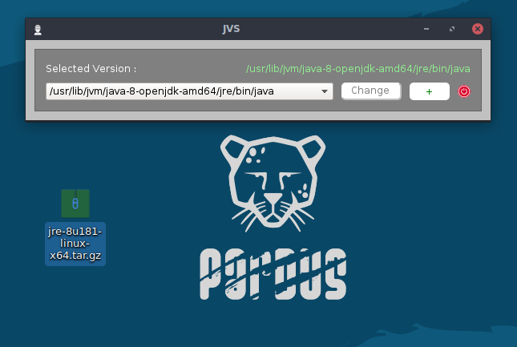
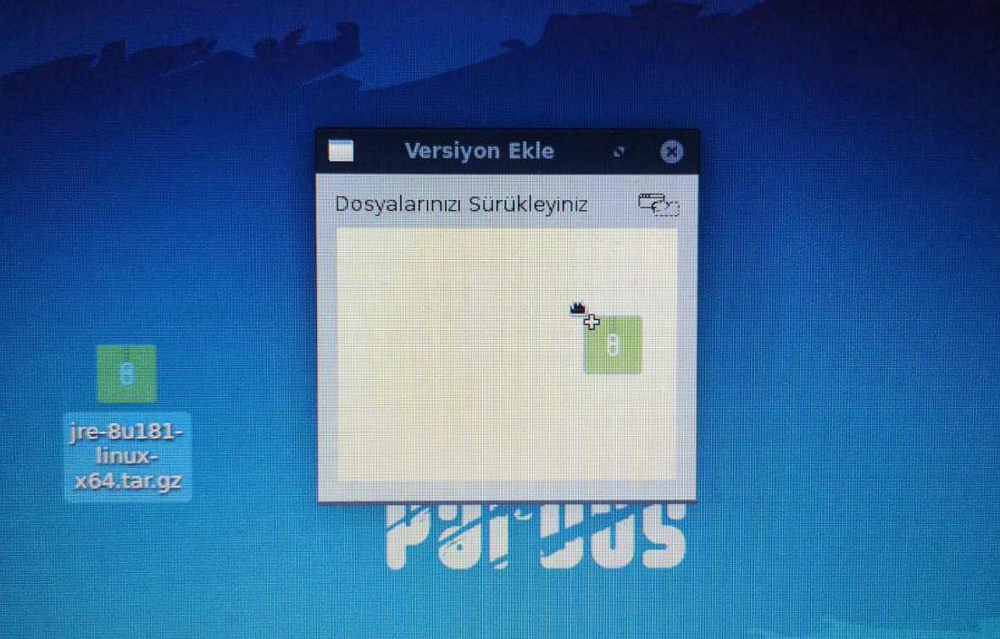
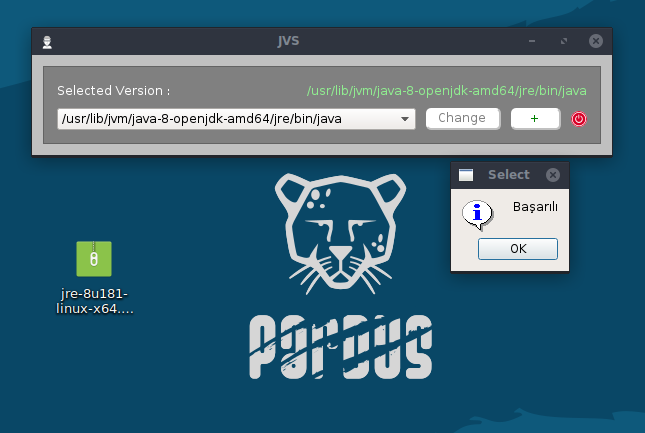
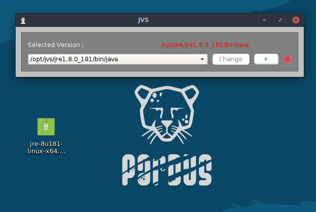
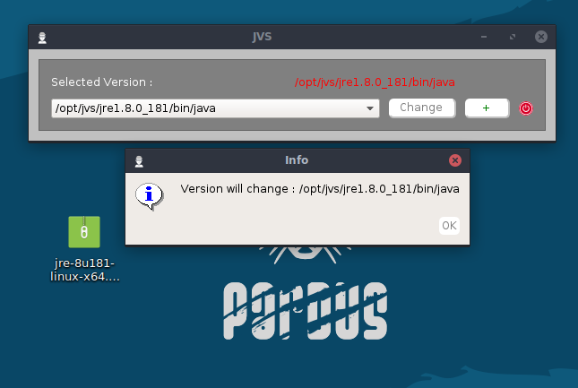
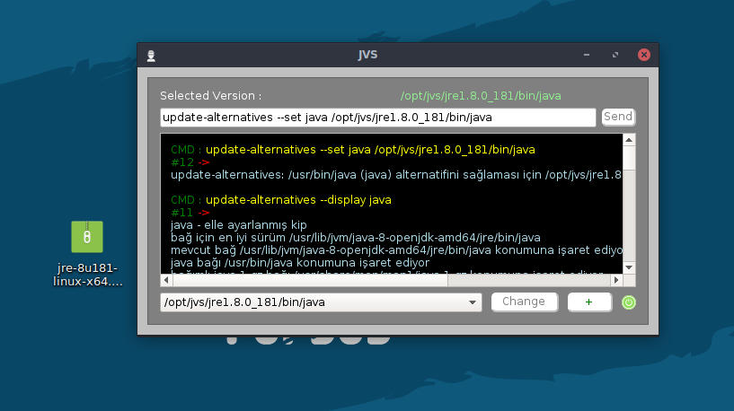

# Java Version Selector [JVS]

**Versiyon	:**  1.0
**Lisans  	:**  GPL
**Contributors  :**  Burak Büyükyüksel
   

## Nedir?

Var olan Java versiyonlarını listeleyerek, istenilen versiyonun seçilebilmesini sağlar.

## İmkan Sağlar;

*	"tar.gz" uzantılı java dosyasını sürükle-bırak yöntemi ile sisteme yükleme
*	Güncel olan Java versiyonunu görüntüleyebilme
*	Arka planda yapılan işlemlerinin log çıktılarını görüntüleyebilme
*	Basitleştirilmiş terminal arayüzü ile kabuğa komut yollayabilme

### Not
* Programın sağlıklı çalışabilmesi için "root" yetkili çalıştırılmalıdır.
* Basitleştirilmiş tasarımı ile kabuğa komut geçirip, standart çıktılarını gözlemleyebilme imkanı tanıdığından, projeye bağlı olarak iskelet yapıyı oluşturulabilir.

## Changelog

### 1.0
* Released : September 18, 2018

Initial release